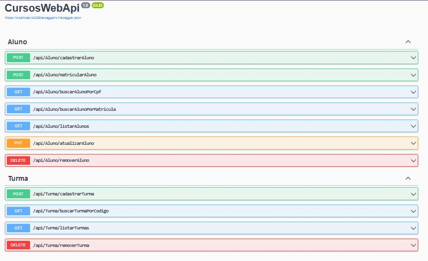

A figura abaixo apresenta a documentação de todas as rotas criadas para o funcionamento do sistema proposto:

Para performar a webApi, utilizei algumas das seguintes bibliotecas:

- Microsoft.EntityFrameworkCore
- Microsoft.EntityFrameworkCore.Design
- Microsoft.EntityFrameworkCore.SqlServer
- Microsoft.EntityFrameworkCore.Tools
- AutoMapper

Nesta aplicação, utilizei o padrão repository, porque ele oferece uma abstração para o acesso a dados, permitindo uma separação clara entre a lógica de negócios e a lógica de acesso a dados. Isso facilita a manutenção, a testabilidade e a flexibilidade do código, permitindo a troca de implementações de persistência sem afetar a lógica de negócios. Além disso, este padrão promove a reutilização de código e encapsula a lógica de consulta e manipulação de dados.
